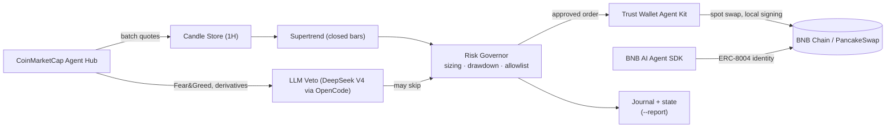
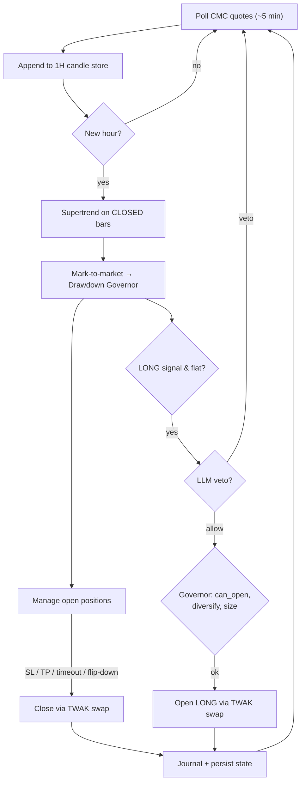

# DESIGN — Fidukat

> This document explains WHAT Fidukat is, WHY it is designed this way, and HOW each
> part works — so an AI agent or contributor can get up to speed without reading all
> the code. For the overview and quickstart, see `README.md`. For setup, see
> `docs/SETUP.md`. For the backtest methodology, see `docs/STRATEGY.md`.

---

## 1. Competition context

**BNB Hack: AI Trading Agent Edition** (CoinMarketCap × Trust Wallet × BNB Chain),
**Track 1 — Autonomous Trading Agents** ($24k, 5 winners). Live trading 22–28 June
2026 on BNB Chain, scored on **live PnL**.

The rules shape the ENTIRE design:

| Rule | Design implication |
|---|---|
| Ranked by total return, BUT **drawdown > ~30% = disqualified** | Drawdown is enemy #1. The governor brakes well before 30%. |
| **≥1 trade/day** (7 over the week) | Daily-trade guarantee in the governor. |
| Only **149 specific BEP-20 tokens** count | Token allowlist; backtested on this universe. |
| Must hold in-scope balance at start; return measured hourly | Capital stays deployed; hourly loop. |
| Simulated transaction costs | Backtest uses a 0.05% fee. |
| Agent registered **on-chain** before 22 June | `twak compete register` to `0x212c…aed5`. |

**Bottom line:** *"most profit without blowing up."* The winner is steady profit
without blowing up — not the most aggressive bot. Most entrants will ship a greedy
agent that trips the drawdown gate. Fidukat wins through **discipline**.

---

## 2. Core thesis & philosophy

**Trade decisions are 100% DETERMINISTIC; the LLM may only VETO.**

A 2-year backtest shows that a simple rule-based strategy plus strict drawdown
management beats an "LLM decides the direction" agent (which tends to lose and skews
bullish). Therefore:

- **Entry signal** → deterministic Supertrend (validated).
- **Sizing, exits, drawdown** → deterministic governor.
- **LLM** → only answers *"is there a strong reason to SKIP this entry?"* using CMC
  market context. Defaults to DeepSeek V4 Flash via OpenCode (~90% cheaper than
  Anthropic; provider-pluggable). Default: do not veto. The LLM is an extra brake, not a
  throttle.

This is also the **differentiating narrative** for the judges: an agent that
deliberately refuses to let an LLM gamble, backed by quantitative evidence. The name
**Fidukat** (*fidusia* + *berkat*, fiduciary + grace) captures it: act in the
principal's interest, preserve capital, hold in trust.

---

## 3. Strategy (re-backtest result)

Re-backtest at 1H over 2 years on the eligible token universe (5 robust signals × MM
× Monte Carlo ×500). Clear winner: **Supertrend** — Exp R +0.108, profitable on 20/29
tokens, Monte Carlo drawdown 18% (under the gate), risk of ruin 0%. The others are
discarded for weak edge or drawdown that breaches the gate. See `docs/STRATEGY.md`.

**Live config:** Supertrend (period 10, mult 3), **SL 2% / TP 6% / max hold 48h**,
**volatility-targeted** sizing. **15-token basket** (Exp R ≥ +0.13, MC DD ≤ 18%):
`DOGE, UNI, DOT, COMP, AVAX, ACH, ETH, BCH, FIL, ZIL, YFI, TRX, 1INCH, AAVE, XRP`.

**Execution = SPOT LONG-ONLY.** TWAK supports spot swaps only (no perps/futures). On
a down-signal the agent goes flat (holds USDT). This also keeps self-custody clean.

---

## 4. Data reality (important)

The CoinMarketCap **free tier** does NOT serve OHLCV/candlesticks (gated). What it
does serve: real-time batch quotes, Fear & Greed, and the Agent Hub MCP (technical
analysis, derivatives, narratives). Since Supertrend needs 1H candles:

> **The agent builds its own 1H candles** from CMC `quotes/latest` polling
> (`data/candles.py`). One batch call (15 tokens) every ~5 minutes forms OHLC →
> ~2,000 credits/week (well under the 15,000/month free quota). 100% CoinMarketCap
> data, zero third-party exchanges.

**Warmup:** Supertrend needs ~13 bars, so run the agent ~1 day before the window to
accumulate candles. (DEV can use `SEED_CACHE=1` to warm up from local cache.)

---

## 5. Module architecture

```
data/cmc.py        CMC client: Pro REST (free batch quotes, Fear & Greed) + Agent Hub
                   MCP (get_global_crypto_derivatives_metrics,
                   get_crypto_technical_analysis [needs numeric id], trending_crypto_narratives).
                   Without a key -> reads local cache (dev / paper offline).
data/candles.py    CandleStore: poll quotes -> 1H OHLC, persists across restarts.
signals/core.py    Deterministic Supertrend. Identical to the backtest engine
                   (cross-checked on 29 tokens: 0 mismatch -> live == validated).
signals/veto.py    LLM veto + CMC context (F&G, derivatives). Default = DeepSeek V4
                   Flash via OpenCode (~90% cheaper than Anthropic); pluggable.
                   Vetoes only; default allow; safe fallback without a key.
risk/governor.py   Vol-targeted sizing, drawdown governor (de-risk @12%, HALT @22% <
                   30% gate, hysteresis), SL/TP/hold, >=1 trade/day, allowlist.
                   Deterministic, auditable, serializable state.
execution/twak.py  Trust Wallet Agent Kit = the sole execution layer.
                   Spot swap (USDT<->TOKEN) on BSC, wallet, price, x402, register.
                   Self-custody local signing; dry-run by default.
integration/identity.py  ERC-8004 on-chain agent identity via the BNB AI Agent SDK.
loop/agent.py      Loop: poll quotes (build candles) -> Supertrend -> LLM veto ->
                   risk gate -> TWAK swap. Persists positions + governor + candles.
backtest/          Validation harness: eligible.py, validate.py (source-agnostic,
                   reads cache), fetch_data.py (CMC OHLCV; needs a paid tier).
```

**Data & component flow:**



**One cycle (`run_once`), runs each hour:**



1. poll CMC quotes → update candle store
2. mark-to-market equity → update drawdown governor
3. manage open positions: SL / TP / timeout / Supertrend flips down → swap out
4. find entries: Supertrend LONG → LLM veto (may reject) → governor can_open + sizing → swap in
5. daily-trade guarantee if needed (still subject to the drawdown HALT)
6. persist all state

---

## 6. Sponsor stack — three layers, each doing real work

- **CoinMarketCap Agent Hub** — the data layer: free-tier quotes (→ in-agent 1H candles),
  veto context (Fear & Greed, derivatives, technicals via MCP), paid **x402** confirmation
  quotes at the moment of risk, and a **Skill Hub regime gate** (`daily_market_overview`)
  that stands the agent down in a risk-off tape.
- **Trust Wallet Agent Kit** — the sole execution layer: self-custody local signing,
  autonomous-mode swaps, native **x402** settlement, and guardrails (drawdown cap,
  allowlist, per-trade and daily limits, slippage). Keys never leave the machine.
- **BNB AI Agent SDK** — ERC-8004 agent-identity integration (`integration/identity.py`),
  optional and not on the live trading path (see §9, Non-goals).
- **BNB Chain** — execution venue (PancakeSwap via TWAK), x402 settlement rail, and the
  on-chain participant registry.

---

## 7. Guardrails (deterministic, in `risk/governor.py`)

- **Drawdown governor**: size scales down linearly from 12%→22% drawdown, **HALT** at
  22% (8% buffer below the 30% gate), resumes only after recovery < 15% (hysteresis).
- **Vol-targeting**: `risk = clamp(2% · ref_atr/atr, 0.4%, 5%)` — volatile setups get
  smaller size.
- **Diversification**: per-position notional capped at 34% of equity, max 4 concurrent
  positions — a single-name gap cannot blow the gate.
- **Allowlist**: only the 15 validated tokens.
- **Daily-trade guarantee**: take the best LONG signal if no trade yet this UTC day
  (cutoff configurable via `FORCE_TRADE_AFTER_UTC_HOUR`, currently `0` = any hour) —
  still subject to the drawdown HALT (discipline beats quota).

Signals are computed on **closed** 1H bars only (so live == backtest), while MTM, SL/TP
checks, and entries use the **current** price from the latest quote. All HTTPS calls use
verified TLS. The LLM veto treats market data as untrusted (prompt-injection guard) and
can only skip a trade. Every open/close is written to `state/journal.jsonl`; `--report`
prints a human-readable summary (equity, drawdown, win rate, recent trades).

---

## 8. Status

**Live on BSC mainnet:** self-custody wallet funded, agent registered on-chain
(`twak compete register`), real TWAK-signed swaps executed. The **x402** pay-per-call
confirmation and the **CMC Skill Hub regime gate** are both wired into the live loop.
Backtest, all modules, candle store (from real CMC quotes), the LLM veto, and the HTML
dashboard are in place; 21 unit tests pass with no network or keys.

**Optional / not on the live path:** the ERC-8004 identity (`integration/identity.py`) is
runnable but not activated — see §9. The LLM veto needs an OpenCode/DeepSeek key
(`VETO_API_KEY`) or it safely no-ops.

**Repo note:** the public repo is 100% CoinMarketCap (zero references to any other
exchange). The backtest is private research; the third-party data fetcher lives in a
gitignored file (`*_private.py`). The full edge research is not included.

---

## 9. Design decisions & non-goals

Every choice below is deliberate. The bot is built to run unattended on a real user's
machine and protect real capital; these are the trade-offs a careful developer makes, and
the things we chose *not* to build because the use case doesn't need them.

**Decisions:**

- **Spot, long-only.** Trust Wallet Agent Kit signs spot swaps; there is no perps surface.
  Rather than fake leverage, the agent goes flat (holds USDT) on a down-signal. Simple,
  honest, and within the one execution layer we trust with the keys.
- **The LLM may only veto, never decide.** Direction and sizing are 100% deterministic
  (Supertrend + governor). An LLM that picks direction tends to lose and skews bullish;
  confining it to a veto keeps the blast radius minimal and the strategy reproducible.
- **x402 for confirmation data.** A low-frequency unattended agent shouldn't carry a
  monthly data subscription or a long-lived API key. It pays ~$0.01 only at the instant it
  risks capital, and refuses the trade if the paid quote disagrees with its own read.
- **Regime gate via the CMC Skill Hub.** Once a day the agent asks for a market-regime
  read and stands aside from new discretionary longs in a risk-off tape — "knows when not
  to trade," wired in rather than slogan.

**Non-goals (deliberately not built):**

- **No shorting / perps.** A venue (TWAK) constraint, embraced rather than worked around.
- **No TWAK token risk-score gate.** The 15-token universe is fixed and contract-verified
  by hand; a per-trade risk score on DOGE/ETH/XRP would be redundant. It would matter only
  for an agent trading arbitrary or freshly-deployed tokens — which this is not.
- **ERC-8004 identity is integrated but not activated.** An on-chain agent identity exists
  so other parties can discover and trust an agent. A personal self-custody trader has no
  such counterparty, so activating it would be ceremony, not function. The code is present
  and runnable for anyone who does need it.
- **No cross-asset / equity-correlation skills.** Those CMC skills need equity data outside
  our access tier and return a blocked read; we leave them out rather than show a dead path.
- **No online-learning or strategy-zoo regime switching.** In a one-week gated contest,
  an unvalidated adaptive layer is a way to break a validated edge. Discipline beats
  cleverness here.
