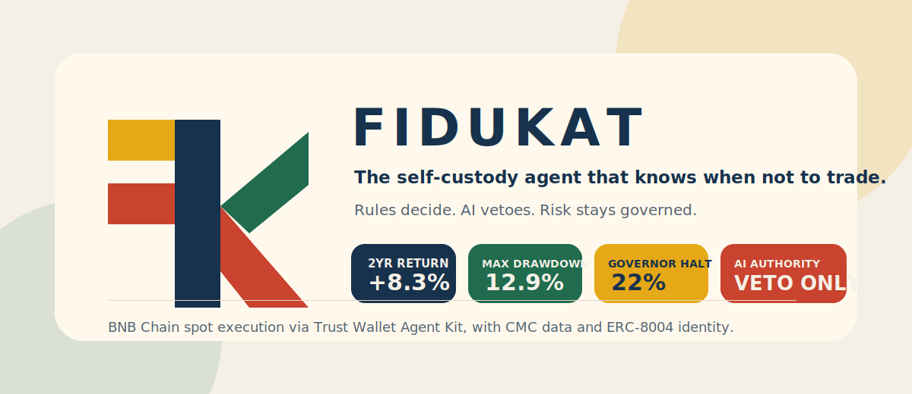
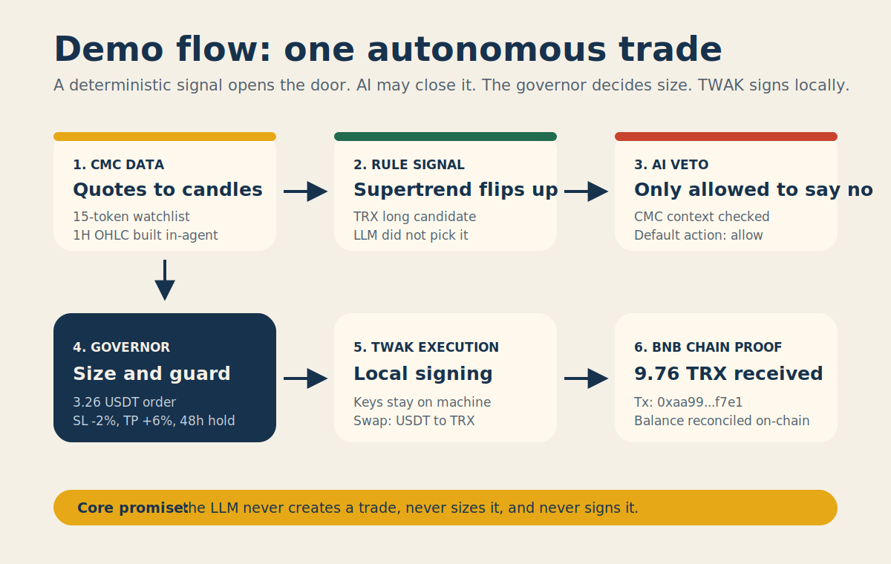
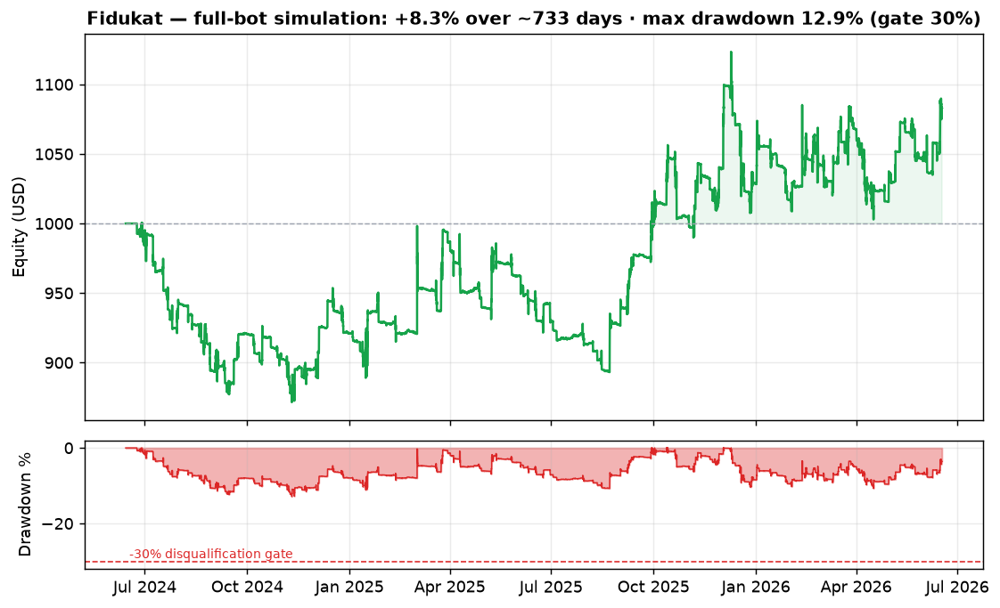
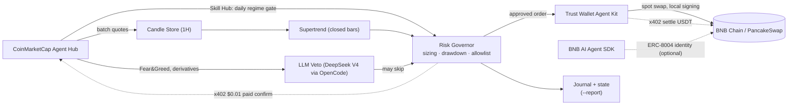

<div align="center">



# Fidukat

**The self-custody trading agent that knows when not to trade.**

Rules decide. AI vetoes. Risk stays governed.

[▶ Demo video](https://www.youtube.com/watch?v=1whkKT2-6BU) ·
[On-chain proof](#on-chain-proof-bsc-mainnet--live-self-custody) ·
[Backtest](#backtested-track-record-the-full-bot-2-years) ·
[Architecture](#architecture) ·
[Demo flow](#demo-flow) ·
[Quickstart](#quickstart)


Submission for **BNB Hack: AI Trading Agent Edition** (CoinMarketCap × Trust Wallet ×
BNB Chain) — **Track 1, Autonomous Trading Agents**.

</div>

---

## ⚡ The pitch

**Every other agent is built to post a big number. Fidukat is built not to blow up — and
in a contest where one bad drawdown disqualifies you, that's how you win.**

It's an AI trading agent you could actually leave running on your own machine. It reads
the market through **CoinMarketCap**, asks the **CMC Skill Hub** whether the regime even
*supports* taking risk today, pays a cent over **x402** for a fresh quote at the exact
moment it commits capital, and signs every swap **locally through Trust Wallet** — keys
never leave the laptop. The rules decide direction; the AI can only *veto*; a drawdown
governor brakes hard long before the line that cuts everyone else.

No leverage, no hype, no custody handed to anyone. **Your keys, your rules, capital
preserved first** — a fiduciary, not a gambler. All three sponsor layers (CMC data ·
Trust Wallet execution · BNB Chain venue + on-chain registration) doing real work, live
on mainnet.

---

## TL;DR — the whole submission in ten seconds

- **Live, self-custody BSC agent:** Fidukat has an on-chain wallet, competition
  registry entry, bootstrap swap, and a real TWAK-signed mainnet trade.
- **AI is deliberately constrained:** the LLM can only veto a deterministic
  Supertrend entry; it cannot invent trades, size positions, or sign transactions.
- **Built for the drawdown gate:** the governor de-risks from 12% drawdown and
  halts new entries at 22%, leaving an 8% buffer below the 30% disqualification line.
- **Backtested as the full bot:** ~2 years, 15-token basket, +8.3% return,
  12.9% max drawdown, 959 closed trades, 720/735 days with at least one trade.
- **Sponsor stack is load-bearing:** CoinMarketCap data, Trust Wallet Agent Kit
  execution, and BNB Chain proof — all doing real work live on mainnet. (An optional
  BNB AI Agent SDK / ERC-8004 identity runs on testnet; it is not on the live path.)

> **Fidukat** = *fidusia* (fiduciary) + *berkat* (grace). A fiduciary acts in the
> principal's best interest and holds assets in trust — never gambling with what
> isn't theirs to risk. That is the whole design: **your keys, your rules, capital
> preserved first.**

---

## ⛓️ On-chain proof (BSC mainnet — live, self-custody)

Fidukat trades **live on BNB Smart Chain** from its own self-custody wallet. Every
position is opened and closed by **local Trust Wallet signing — keys never leave the
machine.** Nothing here asks for trust; it is all verifiable on-chain.

| What | On-chain reference |
|---|---|
| **Agent wallet** — self-custody, TWAK-signed | [`0xe656…57E3`](https://bscscan.com/address/0xe65627481199a57a53d06228B8b1c470C0Cc57E3) |
| **Track 1 competition registry** — registered entry | [`0x212c…aed5`](https://bscscan.com/address/0x212c61b9b72c95d95bf29cf032f5e5635629aed5) |
| **Bootstrap funding** — swapped BNB → 7.93 USDT to seed trading capital | [`0xa203…6274`](https://bscscan.com/tx/0xa203fc410d0cd2a5d5642f54a6bb3d897cc5df52822289b2965fd41cdf9f6274) |
| **Live trade** — Supertrend long, 3.26 USDT → 9.76 TRX (24 Jun) | [`0xaa99…f7e1`](https://bscscan.com/tx/0xaa99aecf3caaebee6683adf8fec4c93035fddf521f601d146c6a3aaffe1cf7e1) |
| **x402 data payment** — Permit2 approval; agent pays per-call for confirmation data | [`0x25df…6af9`](https://bscscan.com/tx/0x25dfaa352e89c77cc2a685db09e1b566bea6ceb7f2852a538f92c54e66926af9) |

The agent wallet's **full trade history is public** — click through and audit every
open and close. Capital is intentionally small (a real, self-funded test wallet); the
point is a *genuinely* hands-off self-custody loop on mainnet, not a paper demo.

---

## How it works (in plain words)

Every 5 minutes Fidukat reads live prices from CoinMarketCap and builds its own hourly
candles. Once an hour it asks one question per coin: *is this coin clearly starting an
uptrend?* (the Supertrend rule). If yes — and a quick AI sanity-check doesn't object —
it buys a measured amount using **its own self-custody wallet** (Trust Wallet), spreading
across up to 4 coins. Each position has a fixed exit: take profit at +6%, stop loss at
−2%, or leave after 48h. A **"governor"** shrinks the bets as losses grow and stops
trading entirely well before the −30% line that disqualifies you. The AI never decides
*what* to trade — it can only veto. Think of it as a careful fiduciary, not a gambler.

**Why the on-chain history can look quiet — by design.** Those Supertrend entries (up to
4 at once) are the profit engine, but two things deliberately hold it back. In a risk-off
regime the agent stands aside from *new* discretionary longs rather than buy into a
falling tape. And the competition's one-trade-a-day requirement is met by a **fallback
floor**: only if a whole UTC day passes with *no* real signal does the agent place one
small keepalive trade to stay eligible — when real signals do fire (and the regime
allows), it trades those instead. So a calm day on-chain is restraint working, not the
bot sitting idle.

**See it for yourself — no keys, no risk:**

```bash
.venv/bin/python simulate.py     # replays the full bot on 2 years of history
```

It prints exactly how the bot would have traded: return, max drawdown, win rate, and
whether it stays inside the 30% gate.

## Demo flow

**▶ Watch the walkthrough: https://www.youtube.com/watch?v=1whkKT2-6BU**



The video walks the same sequence end to end:

1. `--report` dashboard/status: current equity, drawdown, positions, recent trades.
2. Signal trace: CMC quote update → closed 1H candle → Supertrend LONG candidate.
3. Veto trace: LLM receives CMC context and can only return allow/skip.
4. Governor trace: sizing, SL/TP, drawdown state, and allowlist checks.
5. TWAK execution: locally signed swap, then BscScan transaction proof.
6. Reconciliation: wallet balance confirms the position size after the swap.

---

## 🔬 Anatomy of one trade (real, on-chain)

The live trade from **24 Jun 2026**, end to end:

1. **Signal.** On the hourly close, Supertrend flips **up** on TRX (period 10, mult 3) —
   a fresh uptrend. Every other coin in the basket is flat or down, so they are skipped.
2. **Veto check.** The deterministic entry is offered to the **optional** LLM veto with
   CoinMarketCap context (Fear & Greed, derivatives) — *any clear reason to skip?* The
   veto can only ever *reject*; with no provider key configured it safely no-ops and the
   validated rule proceeds.
3. **Sizing.** The governor sizes by volatility and caps the order at available USDT (it
   never spends gas BNB): **3.26 USDT** buys **9.85 TRX**. Stop loss −2% (`$0.3244`),
   take profit +6% (`$0.3508`), max hold 48h — all fixed up front.
4. **Self-custody execution.** Trust Wallet Agent Kit signs the swap **locally** and
   broadcasts it
   ([`0xaa99…f7e1`](https://bscscan.com/tx/0xaa99aecf3caaebee6683adf8fec4c93035fddf521f601d146c6a3aaffe1cf7e1)).
5. **Reconcile.** State is marked against the **on-chain balance** (verified via
   `balanceOf` — **9.76 TRX** after slippage), not the optimistic quote, so the eventual
   close sells exactly what the wallet holds, never reverting on a rounding gap.
6. **Outcome.** TRX drifted down and the position **stopped out at −2% the next day** — a
   small, pre-defined loss. That is the design working: every loss is capped tight so no
   single trade can threaten the drawdown gate.

The LLM never chose TRX or the size — the rule did. Capped losses, not big calls, are the
safety model.

---

## The thesis

Track 1 is scored on **live PnL with a hard drawdown gate**: exceed ~30% max
drawdown and you are disqualified, no matter how high the headline return. The motto
is literally *"most profit without blowing up."*

Most entries will ship a greedy LLM-driven agent, post a big number, hit the drawdown
gate, and get cut. **Fidukat is built for the gate, not against it:**

- **Trade decisions are 100% deterministic** — a Supertrend signal that won a 2-year
  backtest (highest expectancy *and* lowest drawdown of five candidates).
- **The LLM may only VETO, never decide.** Research shows an LLM that "picks the
  direction" tends to lose and skews bullish. Here the LLM only answers *"is there a
  clear reason to skip this rule-based entry?"* using CoinMarketCap context. It is
  **optional and provider-pluggable** (default: a low-cost DeepSeek model via OpenCode);
  with no key configured it safely no-ops and the validated rule proceeds unchanged.
- **A drawdown governor brakes hard at 22%** — an 8% buffer below the 30% gate.

Fidukat wins by restraint, not aggression.

## 📈 Backtested track record (the full bot, ~2 years)

Replaying the **entire bot** — Supertrend entries, volatility-targeted sizing, the
drawdown governor, diversification caps, the daily-trade rule, and simulated swap fees —
over **~2 years of hourly data** on the 15-token basket (normalized to a $1,000 book):



| Metric | Result |
|---|---|
| Return (~2 yr) | **+8.3%** |
| **Max drawdown** | **12.9%** — never close to the 30% gate |
| Days with ≥1 trade | **720 / 735** (daily rule met; keepalive is a fallback floor) |
| Closed trades / win rate | 959 / 33% |
| Exit mix | SL 571 · TP 140 · timeout 229 · flip 19 |

Read the shape, not just the number: ~14 months grinding sideways-to-down (trough −12.9%)
before the trend pays off. A **low win rate with positive expectancy** is the signature of
trend-following — many small stops, fewer larger wins. **The headline is the drawdown, not
the return.** Reproduce it: `.venv/bin/python simulate.py --chart assets/backtest-equity.png`.

## Validated strategy

Re-backtest of five robust signals on the competition's eligible token universe (1H,
2 years, SL 2% / TP 6%, Monte Carlo ×500). Clear winner:

| Signal | Avg Exp R | Profitable in | Monte Carlo DD | Risk of Ruin |
|---|---|---|---|---|
| **Supertrend** | **+0.108** | **20/29** | **18%** | **0.0%** |
| ATR Breakout | +0.045 | 18/29 | 51% ⚠️ | 0.2% |
| Volume Breakout | +0.015 | 15/29 | 60% ⚠️ | 7.5% |
| Donchian | +0.005 | 12/29 | 66% ⚠️ | 10% |
| VCP | −0.033 | 10/29 | 57% ⚠️ | 7.5% |

Supertrend is the only one combining the **highest edge** with the **lowest
drawdown** (18% < the 30% gate). Everything else is discarded.

**Live config:** Supertrend (period 10, mult 3), SL 2% / TP 6% / max hold 48h,
volatility-targeted sizing. **15-token basket** (Exp R ≥ +0.13, MC DD ≤ 18%):
`DOGE, UNI, DOT, COMP, AVAX, ACH, ETH, BCH, FIL, ZIL, YFI, TRX, 1INCH, AAVE, XRP`.
Execution is **spot long-only** (Trust Wallet Agent Kit supports spot swaps, not
perps): on a down-signal the agent goes flat (holds USDT).

## Architecture



**File map:**

```
data/cmc.py        CoinMarketCap client: Pro REST (batch quotes, Fear & Greed) +
                   Agent Hub MCP (derivatives, technical analysis, narratives).
data/candles.py    Candle store: builds its own 1H OHLC from CMC quote polling
                   (free-tier CMC has no historical OHLCV). Persists across restarts.
data/skillhub.py   CMC Skill Hub client (MCP/Streamable HTTP). Runs daily_market_overview
                   once per UTC day as a market-regime gate; cached, fail-open.
signals/core.py    Deterministic Supertrend — identical to the backtest engine
                   (cross-checked on 29 tokens: 0 mismatch -> live == validated).
signals/veto.py    LLM veto + CMC context. Default = a low-cost DeepSeek model via
                   OpenCode; provider-pluggable. Vetoes only; safe no-op without a
                   key. Anthropic optional backup.
risk/governor.py   Volatility-targeted sizing, drawdown governor (de-risk @12%,
                   HALT @22%, hysteresis), SL/TP/hold, >=1 trade/day, token allowlist.
execution/twak.py  Trust Wallet Agent Kit = the sole execution layer. Self-custody
                   local signing, autonomous mode, native x402, slippage guard.
                   Spot swaps on BSC (USDT <-> token).
integration/identity.py  ERC-8004 on-chain agent identity via the BNB AI Agent SDK.
loop/agent.py      Loop: poll quotes (build candles) -> Supertrend -> LLM veto ->
                   risk gate -> x402 paid confirmation quote -> TWAK swap. All state
                   persists across restarts.
backtest/          Validation harness (eligible.py, validate.py, fetch_data.py).
```

Full rationale and data-layer details: see **[DESIGN.md](DESIGN.md)**.
Setup and run instructions: see **[docs/SETUP.md](docs/SETUP.md)**.
Deploy & operate (systemd/Docker, go-live, monitoring): see **[docs/RUNBOOK.md](docs/RUNBOOK.md)**.
Strategy methodology and results: see **[docs/STRATEGY.md](docs/STRATEGY.md)**.
Track 2 (CMC Strategy Skill — backtestable spec): see **[track2/](track2/)**.

## The agent stack

Each layer earns its place by doing real work in the loop, not by sitting on a checklist:

- **CoinMarketCap Agent Hub** — the data layer: free-tier batch quotes (built into
  in-agent 1H candles), agent-native veto context (Fear & Greed, derivatives,
  technicals via MCP), **paid x402 confirmation quotes at the moment of risk**, and a
  **Skill Hub market-regime gate** (`daily_market_overview`) that stands the agent down
  from new longs in a risk-off tape.
- **Trust Wallet Agent Kit** — the sole execution layer: self-custody local signing,
  autonomous-mode swaps, **native x402 settlement** for pay-per-call data, and
  deterministic guardrails (drawdown cap, allowlist, per-trade and daily limits,
  slippage). Keys never leave the machine.
- **BNB AI Agent SDK** — a verifiable **ERC-8004 on-chain identity** for the agent
  (`integration/identity.py`), runnable and gas-free on BSC testnet.
- **BNB Chain** — execution venue (PancakeSwap via TWAK), x402 settlement rail, and the
  on-chain participant registry (`0x212c61b9b72c95d95bf29cf032f5e5635629aed5`).

## Cost-efficient by design

The LLM is a *veto*, so it runs rarely and cheaply — and the default provider makes it
cheaper still. Fidukat defaults to **DeepSeek V4 Flash via OpenCode** (OpenAI-compatible,
flat low-cost subscription), not a premium model:

| Veto model | Input / Output ($/1M) | vs Anthropic Opus |
|---|---|---|
| **DeepSeek V4 Flash** (default) | **$0.14 / $0.28** | **~97% cheaper** |
| Claude Haiku 4.5 | $1.00 / $5.00 | ~80% cheaper than Opus |
| Claude Opus 4.x | $5.00 / $25.00 | — |

Because the veto fires only on signal flips, total LLM spend for the whole competition
week is cents. A **fallback chain** keeps it reliable: OpenCode → OpenRouter →
DeepSeek-direct (each tier set by an env key, tried in order). And the veto **fails
open** — if every provider is unreachable, no veto fires and the validated rule-based
strategy simply proceeds. On-chain trading stays 100% self-custody via TWAK regardless.

## 💳 Pay-per-call data — pay a cent to verify before risking a dollar

Fidukat runs unattended on a user's own machine and trades only a handful of times a
day. A monthly market-data subscription is the wrong shape for that workload: the agent
sits idle most of the month, and a long-lived API key is one more secret to leak. So at
the single moment that matters — the instant before it commits real capital — the agent
pays **$0.01 over [x402](https://docs.cdp.coinbase.com/x402/welcome)** for an
authoritative, independent CoinMarketCap quote and checks it against the price its own
candle store derived. If the two disagree by more than 5%, the candle is stale or the
feed is wrong, and the agent **refuses the trade** rather than act on bad data. If the
paid call can't complete, trading proceeds anyway (fail-open) — the check is insurance,
never a single point of failure.

This is genuine pay-per-use, not a feature checkbox: no subscription, and **no API key
stored for this path — the payment itself is the authentication.** It settles in the
same USDT the agent already trades with on BSC (the live endpoint advertises a BSC route
alongside the documented Base/USDC one), so there's no second chain or bridged balance
to manage. Gasless after a one-time Permit2 approval; every paid call leaves a receipt
on the trade.

- One-time Permit2 approval (on-chain, verifiable): [`0x25df…6af9`](https://bscscan.com/tx/0x25dfaa352e89c77cc2a685db09e1b566bea6ceb7f2852a538f92c54e66926af9) — the approval that makes every later paid call gasless
- The x402 confirmation is wired into every live entry — `_open_long` logs price, divergence, and amount paid to `state/journal.jsonl` on each new position; the paid `$0.01` calls are real and return live quotes (`credit_count: 1`), settled on-chain by the Permit2 approval above
- Cost: ~$0.01 per entry — cents for a full week, billed only when the agent actually trades

## 🌦️ Regime-aware — it stands aside in a risk-off tape

"Knows when not to trade" isn't just a slogan; it's wired in. Once per UTC day the agent
asks the **CoinMarketCap Skill Hub** for a market-regime read (`daily_market_overview`)
and uses it as a gate: in a **defensive / risk-off regime** it holds back *new
discretionary* longs instead of buying into a tightening tape. The mandatory daily
keepalive still fires, so the bot never trades into a bad backdrop just to chase signals,
yet never falls out of eligibility either.

This is the Skill Hub as a **decision driver**, not a data readout — the platform's
regime judgment actually changes what the agent does. Right now it reads risk-off —
`headwind_tightening / defensive_research_only`, **Fear & Greed 15 (Extreme Fear)**,
negative ETF flow — exactly the tape where an undisciplined bot gets hurt, and exactly
where Fidukat stands aside from new discretionary longs. Cached per day (one call ~90s)
and **fail-open**: if the Hub is unreachable or returns a blocked read, the regime is
`unknown` and trading proceeds unchanged.

## Quickstart

```bash
uv venv --python 3.11 .venv
uv pip install --python .venv/bin/python -r requirements.txt
cp .env.example .env            # add CMC_API_KEY (free tier is enough); keep TWAK_LIVE=0

.venv/bin/python loop/agent.py --doctor   # preflight: keys, data, TWAK, warmup, config
.venv/bin/python loop/agent.py --poll     # test connectivity + start building candles
.venv/bin/python loop/agent.py --loop     # poll every 5 min, evaluate hourly (paper if TWAK_LIVE=0)
.venv/bin/python loop/agent.py --report      # text status (equity, drawdown, win rate, trades)
.venv/bin/python loop/agent.py --report-html # HTML dashboard -> state/report.html (PnL calendar, equity curve)
```

Going live: install TWAK (`curl -fsSL https://agent-kit.trustwallet.com/install.sh |
bash`, paste your Access ID + HMAC from portal.trustwallet.com), register the agent
(`twak compete register`), set `TWAK_LIVE=1`, and run `--loop` ~1 day before the
window opens so the 1H candle history warms up. Full details in
[docs/SETUP.md](docs/SETUP.md).

## Safety & guardrails

- **Dry-run by default** — no real transactions until `TWAK_LIVE=1`.
- **Self-custody** — keys never leave the user; TWAK signs locally throughout.
- **Drawdown governor** — size scales down from 12% drawdown, halts at 22%, resumes
  only after recovery below 15%.
- **Diversification** — per-position notional capped (≤34% of equity) and at most
  4 concurrent positions, so a single-name gap can't blow the gate.
- **Allowlist + daily-trade guarantee + slippage protection** — all enforced
  deterministically in `risk/governor.py`.
- **Verified TLS** on all API calls; the LLM veto treats market data as untrusted
  input (prompt-injection guard) and can only skip a trade, never create one.
- **Trade journal** (`state/journal.jsonl`) records every open/close with PnL and
  reason; `--report` summarizes it for humans / judges.
- **Tested** — `python -m pytest -q` (21 tests: signal, governor, sizing, veto chain,
  candle store; no network or keys needed) and `--doctor` for a live preflight check.

## License

MIT — see [LICENSE](LICENSE).
